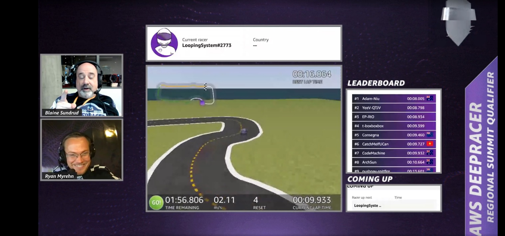

# deepracer-summit-speedaway
Code for the deepracer reward function used for the ANZ Regional Competition 2022

In this repo you can find the reward function I have used for the race my Team participated in representing 
New Zealand company Consegna in the AWS DeepRacer Summit Regional Qualifier in ANZ (Australia and New Zealand region)
competing for the ticket to the Deepracer in Las Vegas Re:Invent 2022.

This reward function is based on the waypoints idea where the speed is based on the location of the vehicle on the track.
Compared to other models this one was a fairly low maintenance and low expense. 
Training time was under 2 hours.
Model is created for the Summit speedway track which is an official track for the 2022 Re:invent.
This model placed us 5th in the first round of the competition. My collegue ran his model in the second round
which improved on time and placed us in 4th place.
Best time during evaluation run - 10.340
Best time during the competition with speed control - 09.460

## Race result
Our best time on the lap on the Leaderboard placed 5th after the first run

## References
https://www.linkedin.com/pulse/samples-reward-functions-aws-deepracer-bahman-javadi?trk=public_profile_article_view
